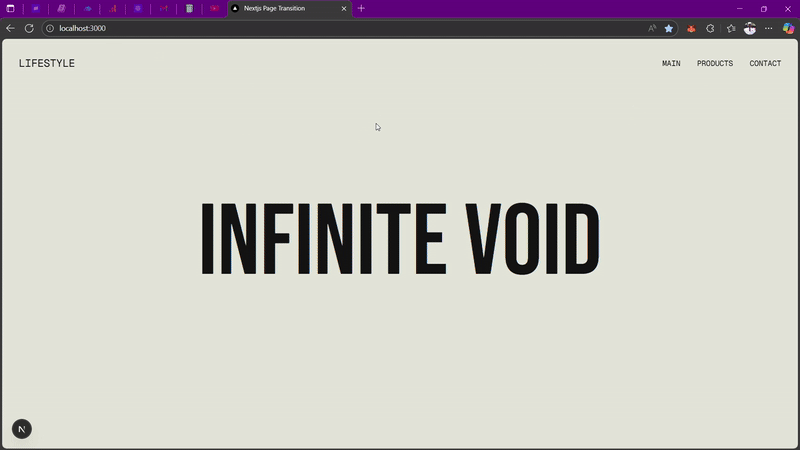

# Nextjs Page Transition

A small Next.js 13+ app demonstrating a custom page transition using GSAP and a SVG logo animation.

## Demo Video

Watch the demo below:

<p align="center">
  
</p>

> If the video does not play, open [public/videos/demo.gif](public/videos/demo.gif) directly.


Quick references
- Transition component: [`PageTransition`](src/components/PageTransition.tsx) — [src/components/PageTransition.tsx](src/components/PageTransition.tsx)  
- Logo used in the transition: [`Logo`](src/components/Logo.tsx) — [src/components/Logo.tsx](src/components/Logo.tsx)  
- Site navigation: [`Navbar`](src/components/Navbar.tsx) — [src/components/Navbar.tsx](src/components/Navbar.tsx)  
- App root layout: [`RootLayout`](src/app/layout.tsx) — [src/app/layout.tsx](src/app/layout.tsx)  
- Pages:
  - Home: [src/app/page.tsx](src/app/page.tsx)
  - Products: [src/app/products/page.tsx](src/app/products/page.tsx)
  - Contact: [src/app/contact/page.tsx](src/app/contact/page.tsx)

Getting started

1. Install dependencies:
```sh
bun install
```

2. Run the development server:
```sh
bun run dev
```

Scripts
- Start dev server: `bun run dev` (see [package.json](package.json))
- Build: `bun run build`
- Start production server: `bun run start`

Notes
- Page transition logic and GSAP timelines live in [`PageTransition`](src/components/PageTransition.tsx). Adjust block count, timings, or logo animations there.
- Fonts and global styles are loaded from [src/app/layout.tsx](src/app/layout.tsx) and [src/app/globals.css](src/app/globals.css).
- TypeScript config: [tsconfig.json](tsconfig.json)

License
- MIT